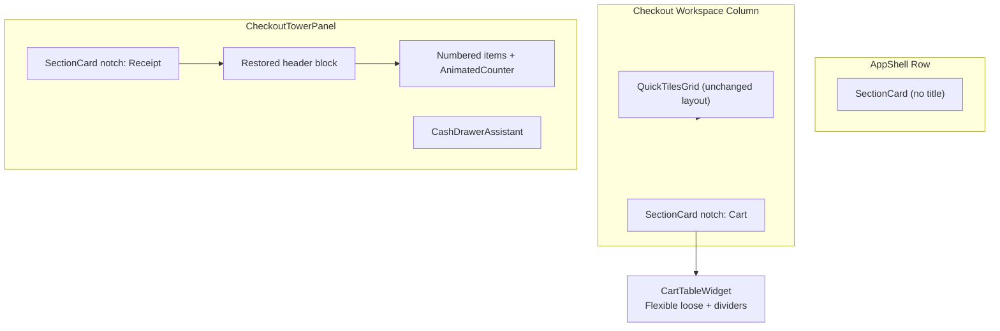

# Checkout UI Card & Animation Adjustments

## Implementation Todos

- [ ] Redesign SectionCard: border-notch title (RTL), optional actions, childFit parameter
- [ ] Remove AppBars from inventory/settings; move titles + inventory actions into SectionCard
- [ ] CartTableWidget: Flexible(loose), column dividers, remove delete icon/onRemove API
- [ ] Quantity editing with ValueNotifier (no setState), replace-on-type, qty >= 1
- [ ] Restore receipt header block in checkout_tower_panel; fix Phosphor icons
- [ ] Add checkout.table.* keys to localization_service + tests
- [ ] Update inventory/settings tests; run flutter test and fix regressions

## Analysis Summary

### What the redesign delivered (22eb046 → 9a51de1)

| Area | Implemented | Gap vs your intent |
|------|-------------|-------------------|
| `SectionCard` | Card with `surfaceContainerLow`, `outlineVariant` border, inline `heading3` title | Title sits **inside** padding — no border-notch legend style |
| `CartTableWidget` | 4-column table, `AnimatedList` slide/fade, tap-to-edit qty, delete icon | No column dividers; delete icon still present; qty edit selects-all instead of replace-on-type; root `Column` uses `Expanded` not `Flexible(loose)`; uses `setState` |
| `CheckoutTowerPanel` | Centered store name, numbered items, `AnimatedCounter` | Old header (store name + receipt icon row) **removed**; title moved to `SectionCard` |
| `QuickTilesGrid` | 100×100 tiles, fade+scale, `SectionCard` | **Out of scope** — keep current layout/alignment as-is |
| Inventory/Settings | `SectionCard` body wrapper | **AppBars still present** — titles not relocated |
| Icons | Mixed | `Icons.close`, `Icons.add`, `Icons.check_circle` violate Phosphor mandate ([specs/DESIGN.md](../../specs/DESIGN.md) §5) |

### Spec alignment

- **Typography**: `heading3` (20px w600) is additive to spec; keep it for notch titles.
- **Animations**: Existing 200ms cross-fade / 300ms slide-fade comply with DESIGN.md §6 (no loops, no blur).
- **RTL**: All positional layout must use `*Directional` APIs (`PositionedDirectional`, `BorderDirectional`, `AlignmentDirectional`).
- **Colors**: No new palette needed — continue `Theme.of(context).colorScheme` (`outlineVariant` for dividers, `surfaceContainerLow` for cards, `scaffoldBackgroundColor` for notch fill).
- **State management**: No `setState` in touched widgets — use `ValueNotifier` + `ValueListenableBuilder` (consistent with `AppShell`'s `_selectedIndexNotifier` pattern).

---

## Architecture After Changes



---

## 1. Cart Table — `Flexible(fit: FlexFit.loose)` + Column Dividers

**File:** [lib/features/checkout/presentation/widgets/cart_table_widget.dart](../../lib/features/checkout/presentation/widgets/cart_table_widget.dart)

### 1a. Wrap outer `Column` in `Flexible`

Current root (line 69) is a bare `Column` with an `Expanded` `AnimatedList` child. `Flexible` only works inside a `Flex` parent.

**Parent chain fix (two coordinated edits):**

1. **[checkout_workspace.dart](../../lib/features/checkout/presentation/views/checkout_workspace.dart)** — cart `SectionCard` must use `mainAxisSize: MainAxisSize.max` so its child participates in vertical flex layout.
2. **[section_card.dart](../../lib/core/widgets/section_card.dart)** — add optional `childFit` parameter (`FlexFit.tight` default, `FlexFit.loose` for cart):

```dart
// When mainAxisSize == max:
Flexible(fit: childFit, child: child)  // replaces Expanded(child: child)
```

3. **cart_table_widget.dart** — wrap root `Column` in:

```dart
Flexible(
  fit: FlexFit.loose,
  child: Column(
    mainAxisSize: MainAxisSize.min,
    children: [headerTable, Flexible(fit: FlexFit.loose, child: animatedList), divider, footerTable],
  ),
)
```

Replace inner `Expanded` around `AnimatedList` with `Flexible(fit: FlexFit.loose)` so few-item carts don't force the list area to fill all vertical space.

Pass `childFit: FlexFit.loose` from checkout workspace cart `SectionCard`. Tower panel keeps default `FlexFit.tight` so receipt still fills height.

### 1b. Vertical column dividers

Extract shared cell builder `_tableCell(Widget child, {bool isLast = false})` applying:

```dart
decoration: BoxDecoration(
  border: BorderDirectional(
    end: isLast ? BorderSide.none : BorderSide(color: colorScheme.outlineVariant),
    bottom: BorderSide(color: colorScheme.outlineVariant), // data rows only
  ),
)
```

Apply to:
- Header row (4 cells, last column no end border)
- Each `_CartTableRow` cell
- Total row cells

Keep existing horizontal header-bottom border and footer `Divider` above total row for section separation.

### 1c. Remove delete icon

- Delete `InkWell` + `Icons.close` block (lines 292–300) and simplify price cell to `AnimatedCounter` only.
- Remove `onRemove` from `CartTableWidget` constructor and `_CartTableRow`.
- Remove `onRemove` wiring in [checkout_workspace.dart](../../lib/features/checkout/presentation/views/checkout_workspace.dart) (lines 69–71).
- `AnimatedList.removeItem` path stays for programmatic removals (e.g. future barcode qty-0 flow) but no UI trigger.

---

## 2. Quantity Editing UX (ValueNotifier — no setState)

**File:** [lib/features/checkout/presentation/widgets/cart_table_widget.dart](../../lib/features/checkout/presentation/widgets/cart_table_widget.dart) — `_CartTableRowState`

### State pattern

Replace all `setState` calls with `ValueNotifier` fields:

```dart
final _isEditing = ValueNotifier<bool>(false);
final _hasTyped = ValueNotifier<bool>(false);
```

- Wrap the quantity cell UI in `ValueListenableBuilder<bool>(valueListenable: _isEditing, ...)`.
- Dispose both notifiers in `dispose()`.
- **No `setState` anywhere** in `cart_table_widget.dart` (or any other file touched by this plan).

### Target behavior

| Action | Result |
|--------|--------|
| Tap quantity cell | Enter edit mode; show `TextField` with cursor; display prior qty as hint/ghost until typed |
| Type digits | **Replace** entire value (first keystroke clears prior, does not append) |
| Enter / tap outside with typed value | Parse int; if **≥ 1**, dispatch `onQuantityChanged`; else revert |
| Enter / tap outside with **no** new input | Keep existing qty (no bloc event) |
| Non-numeric input | Blocked via `FilteringTextInputFormatter.digitsOnly` |
| Bloc updates qty | `AnimatedCounter` cross-fade (200ms) when not editing |

### Implementation sketch

```dart
void _startEditing() {
  _isEditing.value = true;
  _hasTyped.value = false;
  _controller.clear();
  _focusNode.requestFocus();
}

void _onChanged(String value) {
  if (!_hasTyped.value && value.isNotEmpty) {
    _hasTyped.value = true;
  }
}

void _finishEditing() {
  _isEditing.value = false;
  if (!_hasTyped.value) return; // keep bloc value
  final qty = int.tryParse(_controller.text.trim());
  if (qty != null && qty >= 1) {
    widget.onQuantityChanged(widget.item.barcode, qty);
  }
}
```

UI when editing: `TextField` with `hintText: widget.item.quantity.toString()`, `textAlign: TextAlign.center`, `inputFormatters: [FilteringTextInputFormatter.digitsOnly]`, minimal `InputDecoration` (no visible border box — cursor beside number aesthetic).

When not editing: keep `GestureDetector` → `AnimatedCounter`.

---

## 3. Border-Notch `SectionCard` Title (Legend Style)

**File:** [lib/core/widgets/section_card.dart](../../lib/core/widgets/section_card.dart) — full restructure

### Visual spec (RTL-aware)

```
LTR:  --- Cart ---              RTL:  --- سلة المشتريات ---
     |                    |            |                    |
     |     content        |            |     content        |
```

Cart title is the localized `checkout.cart` key **only** — no item count suffix.

### Layout approach

Replace flat `Padding → Column → Text(title)` with:

```dart
Stack(
  clipBehavior: Clip.none,
  children: [
    Card(/* existing shape/color/margin */),
  ],
)
```

Card inner `Padding` gains **extra top inset** (`Spacing.md + 4`) to clear the notch.

Title positioned with `PositionedDirectional`:
- `start: Spacing.md`
- `top: -(heading3LineHeight / 2)` ≈ `-10`
- `child: Container` with horizontal `Spacing.sm` padding and **background color** `theme.colorScheme.surface` (matches scaffold behind card margin — creates border "cut")

### New API surface

```dart
class SectionCard extends StatelessWidget {
  final String? title;
  final List<Widget>? actions;   // NEW — trailing icons (inventory search/add)
  final Widget child;
  final EdgeInsetsGeometry? padding;
  final MainAxisSize mainAxisSize;
  final FlexFit childFit;        // NEW — default FlexFit.tight
}
```

When `title != null`: render notch title + optional `actions` in a `Row` at the notch position (`Expanded` title text, actions at `end`). When `title == null`: unchanged passthrough (nav rail).

### Consumers to update

| File | Title | Actions |
|------|-------|---------|
| [checkout_workspace.dart](../../lib/features/checkout/presentation/views/checkout_workspace.dart) | `checkout.cart` (no count) | — |
| [quick_tiles_grid.dart](../../lib/features/checkout/presentation/widgets/quick_tiles_grid.dart) | unchanged (`'Quick Items'`) | — |
| [checkout_tower_panel.dart](../../lib/features/checkout/presentation/widgets/checkout_tower_panel.dart) | localized `receiptTower` | — |
| [inventory_workspace.dart](../../lib/features/inventory/presentation/views/inventory_workspace.dart) | `inventory` | search + add `IconButton`s |
| [settings_workspace.dart](../../lib/features/settings/presentation/views/settings_workspace.dart) | `settings` | — |

**checkout_workspace.dart** change for cart title:

```dart
// Before:
title: '${t.translate('checkout.cart', languageCode: langCode)} (${cart.items.length})',
// After:
title: t.translate('checkout.cart', languageCode: langCode),
```

---

## 4. Remove AppBars — Relocate Titles

### Inventory — [inventory_workspace.dart](../../lib/features/inventory/presentation/views/inventory_workspace.dart)

- Remove `Scaffold.appBar` entirely (lines 35–41).
- Return `Scaffold(body: SectionCard(title: ..., actions: [...], mainAxisSize: max, child: body))`.
- Move search `IconButton` and add-product `IconButton` into `SectionCard.actions`.
- Keep existing search delegate and `_addProduct` handlers unchanged.

### Settings — [settings_workspace.dart](../../lib/features/settings/presentation/views/settings_workspace.dart)

- Remove `appBar: AppBar(title: Text(title))` (line 163).
- `SectionCard(title: title, mainAxisSize: max, child: body)` — title now in notch.

### Tests

- [inventory_workspace_test.dart](../../test/features/inventory/presentation/views/inventory_workspace_test.dart) line 95: rename test to "should show title and add button in section header"; assertions unchanged (text + plus icon still findable).
- [settings_workspace_test.dart](../../test/features/settings/presentation/views/settings_workspace_test.dart): `'Settings'` text still found via notch title; `Card` count stays 4 (1 outer `SectionCard` + 3 `_SettingsSection` cards).

---

## 5. Restore Receipt Section Header

**File:** [lib/features/checkout/presentation/widgets/checkout_tower_panel.dart](../../lib/features/checkout/presentation/widgets/checkout_tower_panel.dart)

Restore pre-`e0a25b4` header block **inside** the `SectionCard` child (below notch title), adapted to keep redesign improvements:

```dart
// Inside SectionCard child Column — FIRST child
Container(
  width: double.infinity,
  padding: EdgeInsets.all(Spacing.md),
  decoration: BoxDecoration(
    border: Border(bottom: BorderSide(color: colorScheme.outlineVariant)),
  ),
  child: Column(
    crossAxisAlignment: CrossAxisAlignment.start,  // restore left/start alignment
    children: [
      if (settings.storeName.isNotEmpty)
        Text(settings.storeName, style: TextStyles.heading2),
      Row(
        children: [
          PhosphorIcon(PhosphorIcons.receiptDuotone, size: 20),
          SizedBox(width: Spacing.sm),
          Text(t.translate('receiptTower'), style: TextStyles.title),
          if (state.status == CheckoutStatus.confirmed) ...[
            Spacer(),
            PhosphorIcon(PhosphorIcons.checkCircle, color: colorScheme.primary),
          ],
        ],
      ),
    ],
  ),
),
```

**Remove** the duplicate centered `storeName` block currently at lines 39–48.

**Keep** from redesign: numbered item rows, `AnimatedCounter` totals, "Items: N" subtotal row, empty placeholder, footnote, `CashDrawerAssistant`.

**Icon fix:** replace `Icons.add` on New Sale button with `PhosphorIcons.plus`.

---

## 6. Localization Additions

**File:** [lib/features/settings/data/services/localization_service.dart](../../lib/features/settings/data/services/localization_service.dart)

Localize cart table column headers (`No.`, `Name`, `Qty`, `Price`, `Total`) — currently hardcoded English in `cart_table_widget.dart`. Add `checkout.table.*` keys:

| Key | EN | AR |
|-----|----|----|
| `checkout.table.no` | No. | رقم |
| `checkout.table.name` | Name | الاسم |
| `checkout.table.qty` | Qty | الكمية |
| `checkout.table.price` | Price | السعر |
| `checkout.table.total` | Total | الإجمالي |

Add test entries in [localization_service_test.dart](../../test/features/settings/data/services/localization_service_test.dart).

---

## 7. Phosphor Icon Cleanup (incidental, same PR)

| Location | Replace |
|----------|---------|
| `checkout_tower_panel.dart` | `Icons.add` → `PhosphorIcons.plus` |
| `checkout_tower_panel.dart` | `Icons.check_circle` → `PhosphorIcons.checkCircle` |
| `cart_table_widget.dart` | delete `Icons.close` (removed with delete button) |

---

## 8. File Change Matrix

| File | Change type |
|------|-------------|
| [lib/core/widgets/section_card.dart](../../lib/core/widgets/section_card.dart) | **Major** — notch title, `actions`, `childFit` |
| [lib/features/checkout/presentation/widgets/cart_table_widget.dart](../../lib/features/checkout/presentation/widgets/cart_table_widget.dart) | **Major** — Flexible, dividers, qty UX via ValueNotifier, remove delete |
| [lib/features/checkout/presentation/views/checkout_workspace.dart](../../lib/features/checkout/presentation/views/checkout_workspace.dart) | Cart title without count; `mainAxisSize.max` + `childFit.loose` |
| [lib/features/checkout/presentation/widgets/checkout_tower_panel.dart](../../lib/features/checkout/presentation/widgets/checkout_tower_panel.dart) | Restore header block, Phosphor icons |
| [lib/features/inventory/presentation/views/inventory_workspace.dart](../../lib/features/inventory/presentation/views/inventory_workspace.dart) | Remove AppBar, wire `actions` |
| [lib/features/settings/presentation/views/settings_workspace.dart](../../lib/features/settings/presentation/views/settings_workspace.dart) | Remove AppBar |
| [lib/features/settings/data/services/localization_service.dart](../../lib/features/settings/data/services/localization_service.dart) | `checkout.table.*` keys |
| Tests (3 files) | Update AppBar test, localization, card counts if needed |

**No changes needed:** `quick_tiles_grid.dart` (layout/alignment unchanged), `animated_counter.dart`, `text_styles.dart`, theme/color scheme, bloc layer.

---

## 9. Implementation Order

1. **SectionCard notch redesign** + `actions` + `childFit` (foundation for all other items)
2. **AppBar removal** (inventory/settings) — depends on SectionCard `actions`
3. **Cart table** — Flexible, dividers, delete removal, qty UX with ValueNotifier, localized headers, cart title without count
4. **Receipt header restoration** + Phosphor fixes
5. **Tests** — run `flutter test`, fix assertions

---

## 10. Verification Checklist

- [ ] Cart title shows localized "Cart" / "سلة المشتريات" only — no `(N)` suffix
- [ ] Tap qty → type `5` → replaces (not appends); Enter applies; tap outside without typing keeps old qty
- [ ] Qty `0` or empty rejected; qty `1` accepted
- [ ] Column dividers visible in header, rows, total; RTL mirrors divider side
- [ ] Notch title at start (LTR) / end (RTL) cuts card border
- [ ] Receipt shows store name + receipt icon row under notch title
- [ ] Inventory: title + search + add visible without AppBar
- [ ] Settings: title visible in notch without AppBar
- [ ] No `setState` in any modified file — qty edit uses `ValueNotifier` + `ValueListenableBuilder`
- [ ] `flutter test` passes
- [ ] No `Icons.*` remaining in checkout feature files
